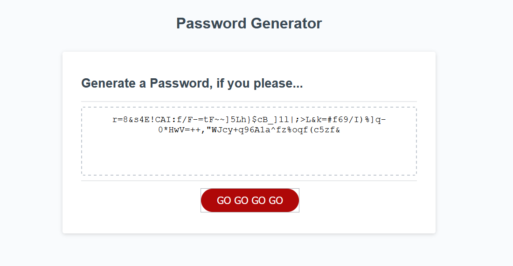

# Rand H Password Generator

## Description
Hello! This deployed webpage is a random password generator that creates such a thing based on User-provided criteria. After pressing the big red button to commence the application, the User will be prompted to enter their desired password length, which must be no less than 8 characters long and no more than 128. The User is then asked if they want to include lowercase characters, uppercase characters, numbers, and special charcaters, and must accept at least one of the options. Given these criteria, the application generates an appropriate password and displays it to the User in the central text box.


## Table of Contents
* [Technologies Used](#technologies-used)
* [How to Access](#how-to-access)
* [What I Did](#what-i-did)
* [Code Snippets](#code-snippets)
* [Acknowledgments](#acknowledgments)
* [Who I Am](#who-i-am)

---

## Technologies Used
* [HTML](https://www.w3schools.com/html/) to structure the "skeleton" of the webpage and its elements.
* [CSS](https://www.w3schools.com/css/) for visual styling to make that HTML much prettier.
* [Javascript](https://www.javascript.com/) to develop the algorithms included in this web application.
* [Git](https://git-scm.com/) for distributed version control, tracking changes over time and making them visible to collaborators.
* [Github](https://github.com/) for version control in the cloud, saving my changes and presenting them clearly to myself and others.

## How to Access
* [Click here](https://prophetrand.github.io/my-password-generator/) to view the deployed Password Generator.

---

## What I Did
For this project I developed the Javascript code necessary to make this application function. Initial HTML and CSS styling was provided by UC Berkeley Coding Bootcamp. To meet the criteria of the User Story, I developed processes that prompt the User for their choice of password length and confirm the character sets that they want to include. I used logic trees involving if/else statements and while loops to validate the User responses in order to make sure that they provide a password length between 8 and 128, and that at least one character set is chosen.

Once the criteria are properly established, a for loop generates each character of the password one by one by accessing a random index of the array that holds all characters from the User's chosen character sets. This character is pushed into the final password value, and the for loop iterates for the number of times equal to the password length provided by the User.

After the for loop concludes the final password is entered into the field with the ID of #password, accessed via the document object (specifically document.querySelector("#password")). This is finally displayed to the User in the central text box.

## Code Snippets 
In the following code snippet, each of the four character sets is added into a separate array called charHolder, but only if their respective variables return true in the if conditions. These boolean values (lowerYes, upperYes, numYes, and specialYes) are determined prior to this code snippet by the User's responses to confirm methods for each. 

The for loop iterates for the number of times that the User inputs as the password length, represented by userLength. The Math methods called here for the variable randomizer generate a random number between 0 and 1, multiplied by charHolder.length, and then round the number down to the nearest integer. The variable finalChar is set to the index of charHolder specified by randomizer, and then finalChar is pushed into the passBuilder array. The for loop then repeats until i = userLength, effectively generating a number of characters equal to userLength and pushing them into passBuilder one by one.

At the end of the snippet, finalPass is formed with the join() method, which consolidates all elements of the passBuilder array into a single string. This string is returned so that its value can populate the field with the ID of #password, which the User will see displayed on the page.
```
if (lowerYes){
    Array.prototype.push.apply(charHolder, lowerChars);
}
if (upperYes){
    Array.prototype.push.apply(charHolder, upperChars);
}
if (numYes){
    Array.prototype.push.apply(charHolder, numChars);
}
if (specialYes){
    Array.prototype.push.apply(charHolder, specialChars);
}

for (var i = 0; i < userLength; i++){
    var randomizer = Math.floor(Math.random() * charHolder.length);
    var finalChar = charHolder[randomizer];
    passBuilder.push(finalChar);
}

var finalPass = passBuilder.join('');
    return finalPass;
```

## Screenshots
Shown here is the appearance of the application after the activation button has been clicked. The generator has been told to write a password that is 128 characters long (the maximum length allowed) and uses every character type made available (lowercase, uppercase, numbers, and special characters).



---

## Acknowledgments
* [W3Schools](https://www.w3schools.com/) has been my go-to for descriptive tutorials on HTML, CSS, and Javascript syntax and best practices. I am eternally grateful for their massive store of documentation.
* UC Berkeley Coding Bootcamp provided the initial code to be refactored.

## License
Bootstrap is available under the MIT License and is copyrighted in 2020 to Twitter. The details of the license can be read [here](https://github.com/twbs/bootstrap/blob/v5.0.0-beta1/LICENSE).

## Who I Am
My name is Rand Hale, and I am an aspiring programmer/web developer based in California.

* [LinkedIn](https://www.linkedin.com/in/rand-hale-83ba389b/)
* [Portfolio](https://prophetrand.github.io/my-responsive-portfolio/)